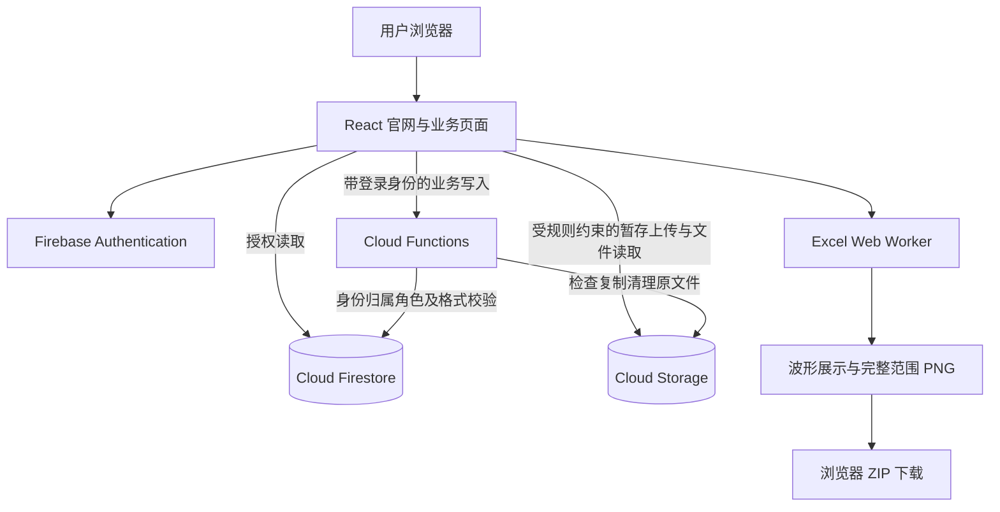

# EVERTRACE／拾光：技能包管理系统 V1 开发文档

**2026-10-06 最新方向：用户确认仅 Firebase Spark 免费版，保留小型 Excel／图片原件和现有登录权限；先验证每件 512 KB、每包 3 MB、最多 12 件。当前范围见 [Spark 需求对齐](Spark-需求对齐.md)，S0～S5 顺序以 [Spark 开发计划](Spark-开发计划.md) 为准。下文旧 Functions／Storage 架构与验收记录保留作历史，不代表 Spark 版已实现或验证。**

> 文档版本：1.0  
> 更新日期：2026-10-05（创建者删除权限修订）
> 阶段：第一版，采用快速迭代开发  
> 原项目目录：`/Users/programmer_mu/Desktop/Codex-shs`  
> 使用对象：全球范围的小型社区，初期成员数量为个位数
> 产品目标：保存、管理和下载由文本、图片及单通道脑电 Excel 组成的技能包  
> 本文交付的是开发规格，尚未执行项目重构、数据迁移或上线部署。

2026-10-05 用户确认调整 AUTH-08／DELETE-01：普通成员可以整体删除自己的技能包并重试清理；分类管理权限保持管理员专属。

## 1. 文档使用方式与决策状态

本文汇总本轮沟通中全部已确认的第一版需求，并给出可执行的重构架构、技术栈、开发顺序和验收标准。

本文区分三种状态：

| 状态 | 含义 |
| --- | --- |
| 已确认 | 用户已经明确决定的业务需求，是 V1 必须实现的范围 |
| 实施建议 | 为落地需求而提出的工程方案，包括技术栈、路由、字段、接口和具体交互细节；不表述为用户已经确认的选型 |
| 待验证 | 需要真实数据、运行环境或使用量验证的参数，不能凭示例推定 |

业务需求按本文实施。技术栈采用第 7 节的建议基线推进设计；正式初始化项目时记录所选依赖版本。Excel 样例和容量参数不影响账户、首页、权限及基础列表开发，但正式开放 Excel 上传前必须完成验证。

本文中的“技能包”“个人智慧包”指同一个业务对象。应用业务页面统一采用“技能包”；品牌暂沿用现有 EVERTRACE／拾光。

## 2. 产品目标与第一版边界

### 2.1 产品定义

系统提供默认首页、独立资料录入页面、技能包管理页面，以及账户和管理员管理功能。

每个技能包必须包含文本资料和至少一份单通道脑电 Excel；图片可选。注册成员可以查看、下载全社区的技能包；普通成员只能编辑自己创建的技能包，管理员可以管理全部技能包。

第一版的核心流程：

```text
访问现有风格首页
  → 点击创建／浏览入口
  → 注册或登录
  → 填写标题、选择或新建分类
  → 输入文本或上传文本文件
  → 上传脑电 Excel，可选上传图片
  → 格式校验与上传
  → 全部成功后保存，对全社区可见
  → 查看文本、图片、波形
  → 编辑／下载；创建者可删除自己的，管理员可删除全部
```

### 2.2 开发原则

1. 快速迭代，每次交付一个可以实际演示和验收的流程。
2. 重新组织代码结构，替换旧业务逻辑，保持现有首页视觉效果。
3. 使用 Firebase 数据库；尽量利用免费额度，避免不必要的云端计算和重复存储。
4. 权限和保存条件由服务端及 Firebase 规则共同保证，不能只隐藏按钮。
5. 不自动更改脑电原始数据，不使用 AI 解读第一版资料。
6. 不为个位数成员引入微服务、复杂队列、独立搜索服务或多社区租户系统。

### 2.3 第一版不包含

- AI 访谈、最多三次追问、AI 自动生成智慧包及原有确认归档流程。
- 音频上传、录音、ASR、TTS、图片内容理解。
- EEG／EMG 硬件连接、设备实时上传及在线信号采集。
- 脑电滤波、频谱分析、医疗或心理分析。
- 多通道脑电、自由列映射、不同 Excel 模板兼容。
- 草稿、发布审核、邀请审批、付费订阅。
- 回收站或应用内删除恢复。
- 多层分类、每包多分类、任意位置包含搜索、全文搜索。
- 禁用账户、删除账户、账号批量管理。
- 技能包私密可见和限时可见；这两项作为后续候选需求保留。

## 3. 全部业务需求清单

### 3.1 首页、视觉和国际化

| 编号 | 已确认需求 | 验收要点 |
| --- | --- | --- |
| UI-01 | 现有界面作为默认主界面 | 根地址展示品牌首页，而非登录页或后台列表 |
| UI-02 | 主界面通过按钮跳转业务页面 | 创建、浏览、管理入口指向真实页面 |
| UI-03 | 尽可能贴近现有前端风格 | 黑白配色、字体、大标题、留白、细线、素材及适度动效延续 |
| UI-04 | 移除旧功能且不影响当前 UI 效果 | 删除旧业务处理，替换入口和文案；无失效事件、布局损坏或动画报错 |
| UI-05 | 提供独立资料输入页面 | 不再使用原 AI 访谈输入接口 |
| UI-06 | 提供独立技能包管理界面 | 列表、筛选、详情及权限对应的操作可用 |
| I18N-01 | 中英文切换 | 首页、账户、业务、管理、错误提示和导出说明均覆盖 |
| I18N-02 | 用户资料保留原文 | 标题、分类名、正文及附件不自动翻译 |

### 3.2 账户与权限

| 编号 | 已确认需求 | 验收要点 |
| --- | --- | --- |
| AUTH-01 | 邮箱加密码注册、登录 | 使用真实账户，不再使用 localStorage 模拟登录 |
| AUTH-02 | 支持退出与密码找回 | 正常退出后无法继续业务操作；密码重置流程可用 |
| AUTH-03 | 注册后直接进入系统 | 不经过管理员批准，注册账户默认为普通成员 |
| AUTH-04 | 未登录禁止全部业务操作 | 不能读取技能包、分类、附件或调用业务写入接口 |
| AUTH-05 | 普通成员可以创建技能包 | ownerId 来自登录身份，不接受客户端伪造 |
| AUTH-06 | 普通成员查看、下载所有技能包 | 全社区共享已保存的完整技能包 |
| AUTH-07 | 普通成员仅编辑自己的技能包 | 不能修改他人的文本、分类或附件 |
| AUTH-08 | 普通成员可删除自己的整个技能包 | 手工调用也只允许自己的；他人的删除及清理重试必须被拒绝 |
| AUTH-09 | 管理员增删改查全部技能包 | 管理员拥有全局业务管理权限 |
| AUTH-10 | 提供成员管理页面 | 成员列表、设置管理员、取消管理员 |
| AUTH-11 | 保护最后一名管理员 | 并发操作也不能导致管理员数量为零 |
| AUTH-12 | 首位管理员由后台设置 | 注册页面不允许选择管理员身份 |

### 3.3 技能包、分类和资料

| 编号 | 已确认需求 | 验收要点 |
| --- | --- | --- |
| PACK-01 | 技能包支持创建、查看、编辑、删除 | 操作范围遵守角色和归属权限 |
| PACK-02 | 标题和分类必填 | 空标题、无分类不能保存 |
| PACK-03 | 文本和 Excel 必须存在，图片可选 | 删除必需资料后不能提交无效状态 |
| PACK-04 | 文本支持直接输入和上传文件 | 可同时使用；直接输入或至少一份有效文本文件满足文本条件 |
| PACK-05 | 附件支持多份 | 多文本、多图片、多 Excel；具体数量上限待验证 |
| PACK-06 | 不设草稿，采用直接保存 | 保存成功立即对社区可见 |
| PACK-07 | 全部附件上传完成且 Excel 校验通过后保存 | 部分失败不展示不完整的新技能包 |
| PACK-08 | 编辑时可添加、替换、移除有权管理的附件 | 普通成员仅管理自己技能包的附件 |
| PACK-09 | 保存失败保留当前表单，允许重试 | 当前页面仍保留输入和已选文件；刷新后恢复不是 V1 要求 |
| CAT-01 | 分类全社区共用 | 成员看到相同的分类集合 |
| CAT-02 | 每包一个分类，分类只有一层 | 数据层拒绝多分类或嵌套分类 |
| CAT-03 | 创建时可选择已有分类或新建分类 | 录入页面可以完成新分类创建 |
| CAT-04 | 成员可创建分类，管理员重命名或删除 | 普通成员不能重命名、删除分类 |
| CAT-05 | 同名分类不重复创建 | 并发创建也只有一份规范化分类 |
| CAT-06 | 删除使用中的分类前迁移技能包 | 管理员选择目标分类，迁移完成才删除源分类 |
| FILE-01 | 文本文件支持 .txt | 有效且非空的文本；编码规则见第 6 节建议 |
| FILE-02 | 图片支持 JPEG、PNG、WebP | 只保存和展示，不做 AI 识别 |
| FILE-03 | Excel 保留原文件供下载 | 不用转换结果覆盖原文件 |

### 3.4 波形、查找、下载和删除

| 编号 | 已确认需求 | 验收要点 |
| --- | --- | --- |
| EEG-01 | Excel 为单通道，采用统一格式 | 不提供自由工作表或列选择 |
| EEG-02 | 数据为时间和脑电幅值 | 使用实际数据确定列名和单位 |
| EEG-03 | 格式错误拒绝保存 | 返回工作表、行、列及具体错误，不自动补值或删异常行 |
| EEG-04 | 每份 Excel 单独展示波形 | 多份文件之间不自动拼接或叠加 |
| EEG-05 | 支持缩放、拖动、悬停读数、恢复全图 | 可查看时间和幅值；时间为连续数值轴 |
| EEG-06 | 第一版展示原始数据 | 不滤波、不做频谱分析、不平滑伪造波形 |
| EEG-07 | 导出完整时间范围 PNG | 不受当前页面缩放影响，包含时间、幅值单位和通道名称 |
| QUERY-01 | 标题前缀匹配 | 输入“木工”可匹配“木工基础”，不承诺包含搜索 |
| QUERY-02 | 按分类筛选 | 与标题和“我的”筛选可组合 |
| QUERY-03 | 查看全部或我创建的技能包 | 不影响普通成员查看全社区内容的权限 |
| QUERY-04 | 默认按创建时间倒序 | 无标题搜索时执行默认顺序 |
| DOWNLOAD-01 | 原附件可以单独下载 | 文件名和内容保持正确 |
| DOWNLOAD-02 | 整个技能包下载为 ZIP | 包含资料说明、输入文本、全部原附件及每份 Excel 的波形 PNG |
| DELETE-01 | 创建者或管理员直接删除，无回收站 | 二次确认后进入不可恢复的业务删除流程 |
| DELETE-02 | 清理技能包和全部关联文件 | 清理失败提示并可重试，不将部分完成显示为成功 |

### 3.5 第一版非功能要求

| 编号 | 要求 | 状态 |
| --- | --- | --- |
| NFR-01 | Firebase 数据库，尽量减少费用 | 已确认 |
| NFR-02 | 小型社区、全球成员使用 | 已确认 |
| NFR-03 | 项目架构重构，旧输入与数据管理逻辑退出运行链路 | 已确认 |
| NFR-04 | 快速迭代方式开发 | 已确认 |
| NFR-05 | 新页面支持桌面、手机；保持现有响应式体验 | 实施建议，延续现有界面基础 |
| NFR-06 | 大文件解析和 ZIP 操作不阻塞页面；展示进度和失败原因 | 实施建议 |
| NFR-07 | 重复点击、重试、并发编辑不会产生重复技能包或覆盖新数据 | 实施建议 |

## 4. 权限矩阵与业务约束

| 操作 | 访客 | 普通成员 | 管理员 |
| --- | --- | --- | --- |
| 浏览公开首页、中英文切换 | 可以 | 可以 | 可以 |
| 注册、登录、密码找回 | 可以 | 可以 | 可以 |
| 查看分类、技能包、图片、波形 | 不可以 | 全部已保存内容 | 全部已保存内容 |
| 下载原附件或 ZIP | 不可以 | 可以 | 可以 |
| 创建技能包、新建分类 | 不可以 | 可以 | 可以 |
| 编辑技能包、移除附件 | 不可以 | 仅自己的 | 全部 |
| 删除整个技能包 | 不可以 | 仅自己的 | 全部 |
| 重命名、迁移、删除分类 | 不可以 | 不可以 | 可以 |
| 查看成员列表、分配角色 | 不可以 | 不可以 | 可以 |

补充约束：

- 公开首页是允许访客访问的展示页面；“未登录不能操作”适用于业务资料，不限制注册登录。
- 注册后直接进入意味着任何成功注册的成员都可查看、下载社区已保存资料。V1 按这一要求执行，不额外加入邀请审批。
- ownerId 在创建后不可改变；管理员编辑他人技能包不改变原创建者。
- 普通成员能移除自己技能包的附件，但不能通过删除全部必需资料使技能包变成无文本或无 Excel 的状态。
- 角色不能由用户表单、浏览器缓存或客户端写入决定。
- 多人编辑使用版本号校验；遇到冲突提示重新加载，不静默覆盖。
- 最后一名管理员保护由服务端事务实现，前端禁用按钮只是辅助提示。

## 5. 页面结构与 UI 保留方案

### 5.1 页面与路由建议

| 路由 | 页面 | 权限及主要内容 |
| --- | --- | --- |
| `/` | 默认首页 | 公开，保留现有风格，入口按钮跳转业务页面 |
| `/login` | 登录 | 邮箱密码登录；成功后返回原目标页面 |
| `/register` | 注册 | 邮箱密码注册；默认普通成员 |
| `/forgot-password` | 密码找回 | 调用 Firebase 重置邮件流程 |
| `/packs` | 技能包管理 | 登录后访问；列表、搜索、筛选、分页 |
| `/packs/new` | 独立录入 | 标题、分类、文本及附件上传 |
| `/packs/:id` | 技能包详情 | 文本、图片、附件、波形、下载 |
| `/packs/:id/edit` | 编辑 | 创建者或管理员访问 |
| `/admin/categories` | 分类管理 | 管理员重命名、迁移、删除分类 |
| `/admin/members` | 成员管理 | 管理员查看成员、设置／取消管理员 |

注册登录采用独立路由，视觉沿用原有档案登记式表单。若继续使用弹窗呈现，也必须有可直接访问的登录路由及返回目标机制。

### 5.2 保留的视觉基线

- 原黑白主色、暖白背景、细线分隔和少量用户识别色。
- 大字号标题、编辑式排版、留白、原有按钮形态与弹窗风格。
- Inter、IBM Plex Mono、Playfair Display 的现有字体方向；中文增加适配字体和回退字体。
- 现有人物档案墙、静物图片、鼠标视差、导航及首次加载体验。
- 原有移动端布局和减少动画偏好支持。

现有样式变量包含 `--paper: #efefeb`、`--ink: #050505`、`--user: #ff542e`。这些作为首轮迁移基准，避免无依据改色。

### 5.3 旧区域如何替换

| 原区域／入口 | 新用途 | 保留方式 |
| --- | --- | --- |
| START A PACK、CREATE YOUR FIRST PACK | 创建技能包 | 保留按钮外观，替换导航行为 |
| SIGN IN | 真实登录 | 保留视觉，替换模拟注册登录逻辑 |
| WISDOM STUDIO／讲述与追问 | 技能包录入入口或资料工作台介绍 | 保留区域的排版骨架，移除聊天、三问进度和旧 API |
| TEXT／VOICE／IMAGE／SIGNAL 素材说明 | TEXT／IMAGE／EEG EXCEL | 保留素材与说明区布局，更新内容 |
| EEG／EMG 采集上传区 | Excel 格式与波形示例介绍 | 移除硬件及 EMG 操作；可保留波形视觉和卡片结构 |
| 旧智慧包生成与确认弹窗 | 技能包详情与下载体验 | 可复用弹窗样式，不复用 AI 归档状态 |
| 原“私密默认”文案 | 登录成员可共享的社区资料说明 | 保留文本位置，改为符合实际权限的内容 |

不能只删除 DOM：需同步处理事件绑定、CSS 选择器、导航锚点、状态初始化及动画依赖。视觉保留指风格、布局和效果延续，不要求保留与新产品矛盾的旧文案或旧操作。

### 5.4 视觉验收

重构前固定首页截图基线，建议视口为 1440×900、768×1024、390×844。

对照检查首屏、导航、人物墙、素材区、页尾和首次加载。允许已确认业务内容替换导致的局部变化；不允许无关字体、配色、宽度、间距或动效退化。截图比较时等待字体和图片加载，固定页面位置，暂停动态效果以减少误报；动效另行人工验证。

## 6. 资料格式、Excel 和导出规格

### 6.1 文件格式

| 类型 | 第一版规则 | 决策状态 |
| --- | --- | --- |
| 输入文本 | 非空正文；与文本文件可同时存在 | 已确认 |
| 文本文件 | `.txt`，建议 UTF-8／UTF-8 BOM；空文件、乱码拒绝并说明 | 扩展名已确认，编码为实施建议 |
| 图片 | `.jpg`、`.jpeg`、`.png`、`.webp`；验证真实类型 | 已确认 |
| Excel | 建议只接受 `.xlsx`，按统一模板；不接受 `.xls`、`.xlsm` | 实施建议，待实际样例确认 |

“文本必须存在”暂按输入正文非空，或至少一份经校验的非空文本文件执行。仅有文件名、空白正文或空文件不满足条件。

### 6.2 已确认 Excel 格式与真实依据

2026-10-05 用户明确确认两列表头 `timestamp_ms`、`value`，时间为毫秒；幅值以最后答复为准：设备原始数值，无物理单位。此前 mV 回答已更正，不进行任何单位换算。当前尚未收到真实脑电 Excel，设备样例与容量验证仍未完成。

现有示例包含 `timestamp_ms`、`value`、`eeg_raw`，设备清单示例提及 512 Hz。该采样率仅是示例，不能据此约束真实文件；该示例不能用于推断物理单位；本次已确认使用无单位设备原始值。

建议模板版本 `eeg-single-channel-v1`：仅一个数据工作表，第一行为固定表头，数据从第二行开始。

| timestamp_ms | value |
| --- | --- |
| 0 | 427 |
| 2 | 421 |
| 4 | 430 |

上表仅为说明格式的合成数据，不是实际测量，不表示固定采样间隔。

- `timestamp_ms`：数值型时间，毫秒；允许小数以兼容非整数毫秒采样间隔。
- `value`：数值型单通道设备原始值，无物理单位；允许正数、负数和零。
- 工作表名称可采用固定模板名称或不限制名称，但文件只允许一个数据工作表；在样例验证时锁定。
- 时间轴暂显示“时间（ms）／Time (ms)”，纵轴显示“脑电原始值／EEG raw value”，通道名称为单通道／Channel 1。
- 如果真实资料已经标明幅值单位，应在模板与导出中使用实际单位；不得自动换算或编造单位。
- 不把示例中的 EMG、信号质量、设备 ID 等附加列直接纳入新版统一模板。

### 6.3 校验规则建议

1. 工作簿可正常解析，文件内容确实是支持的 `.xlsx`。
2. 数据工作表、表头及列结构符合固定模板。
3. 建议至少两条有效采样记录才能形成波形。
4. 时间和幅值均为有限数值，不接受空单元格、文本、NaN、Infinity 或错误值。
5. 建议时间非负且严格递增；重复时间或乱序拒绝，不自动排序。
6. 采样间隔不要求固定，不按示例强制 512 Hz。
7. 模板不支持合并数据单元格、公式或隐藏数据；公式检测需检查工作簿结构，不能把缓存公式值误认为原始数值。
8. 文件末尾仅格式化但没有值的区域不视为数据；数据中间的空行拒绝，不静默跳过。
9. 压缩前文件大小、解压总大小、条目数、行数及解析时间均设上限，具体值经真实样例验证后配置。
10. 返回结构化错误，例如 `fileId + sheet + row + column + errorCode`，界面按当前语言显示说明。

例如：“brain.xlsx，第 18 行，value：幅值为空。请修正后重新上传。”错误详情的展示数量可限制，但不能隐瞒文件整体未通过校验的状态。

上述规则属于实施建议，最终模板在真实样例验证后形成固定合同并附示例文件。不能因尚无真实样例就宣称单位和模板已经验证通过。

### 6.4 波形展示与 PNG

- 每份 Excel 对应一张独立折线图，不自动拼接。
- 使用连续数值时间轴，关闭平滑曲线和无意义的动画；默认展示完整时间范围。
- 提供时间范围缩放、平移、读数、恢复全图；手机支持对应触控操作。
- Excel 解码放在 Web Worker 中；图表只在可见时初始化，关闭页面释放资源。
- 大数据量可采用明确标识的显示抽样，但保留原始数据，避免平均处理抹掉峰值。具体策略通过样例验证。
- PNG 使用独立导出实例，完整时间范围、固定尺寸、白底深色曲线，包含文件名、通道、时间和幅值单位。
- 建议 PNG 初始尺寸为 2400×1000；这是可调整实现参数，不是业务硬性要求。
- 有限分辨率 PNG 是完整时间范围的可视图，不是逐采样点的数值替代；精确数据以原 Excel 为准。
- 缩放当前网页不影响 ZIP 中 PNG 的范围；显示抽样和导出处理不得修改原文件。

### 6.5 ZIP 结构建议

```text
技能包标题_技能包ID.zip
├── README.md                 # 基本信息、分类、创建者、导出时间、单位说明
├── manifest.json             # 版本、文件清单、字节数、校验值及单位
├── text/
│   ├── content.txt           # 存在直接输入文本时生成
│   └── 原始文本文件.txt
├── images/
│   └── 原始图片文件.png
├── eeg/
│   └── 原始脑电文件.xlsx
└── waveforms/
    └── 原始脑电文件_文件ID.png
```

- 保留所有当前有效原文件，历史已移除附件不进入 ZIP。
- 重名文件添加文件 ID 后缀，不能互相覆盖；过滤路径分隔符及非法文件名。
- ZIP 和说明文件按当前界面语言生成，上传的资料原文不翻译。
- 浏览器下载当前文件，完成波形导出后打包；缺失附件、无权访问或 PNG 失败时停止并提示，不静默生成不完整 ZIP。
- 导出绑定技能包版本；处理中如版本改变或技能包被删除，提示重新导出，避免混合不同版本。
- 不长期在云端保存 ZIP 或 PNG 副本；按需生成以降低费用。

## 7. 技术栈建议

业务需求已经确认；下面是本开发文档推荐的实施基线，尚不是用户逐项确认过的技术选型。

| 层次 | 推荐技术 | 职责及选择理由 |
| --- | --- | --- |
| 前端 | React + TypeScript | 组件化重构，统一类型，组织录入、管理和详情 |
| 构建 | Vite | 静态前端开发与构建，方便快速迭代 |
| 路由 | React Router | 页面导航、登录返回目标及角色路由 |
| 样式 | 原 CSS 迁移＋CSS Modules | 保留现有风格，降低样式互相污染；不套用默认后台 UI 模板 |
| 表单 | React Hook Form + Zod | 表单状态与共享校验合同，减少手写重复逻辑 |
| 国际化 | i18next + react-i18next | 中英文 UI、错误代码和导出说明 |
| 波形 | Apache ECharts | 折线、dataZoom、提示读数及 PNG 导出 |
| Excel | read-excel-file | 浏览器和 Node.js 解析统一 `.xlsx`；按样例验证性能与公式检测配合 |
| ZIP | fflate | 浏览器异步压缩，避免服务器反复打包 |
| 账户 | Firebase Authentication | 邮箱密码账户、会话、密码重置 |
| 数据库 | Cloud Firestore Standard | 文本、分类、技能包信息、角色及内部操作记录 |
| 文件存储 | Cloud Storage for Firebase | 原附件，权限与 Firebase 身份集成 |
| 后端 | Cloud Functions 第 2 代 + TypeScript | 受保护写入、服务端 Excel 验证、分类迁移、删除与角色管理 |
| 云端运行时 | Node.js 22 | 与 Functions 支持环境一致；正式部署再次核对生命周期 |
| 静态托管 | Firebase Hosting | 托管 Vite 构建结果和 SPA 路由；不需要 App Hosting |
| 本地开发 | Firebase Emulator Suite | 本地账户、数据、存储和函数调试，减少真实云资源消耗 |
| 验证 | Vitest、Firebase Rules 单测、Playwright | 校验逻辑、权限与关键流程；视觉人工检查配合截图 |
| 工程管理 | npm workspaces、ESLint、锁文件 | 一个仓库，前后端共享合同，避免复杂构建平台 |

依赖版本在项目初始化时固定并提交锁文件，不在本文猜测“最新版本”。read-excel-file 当前支持 `.xlsx`，不支持传统 `.xls`；若实际文件必须使用 `.xls`，需调整合同和解析库，而不是伪装兼容。

不采用原设计文档中的 PostgreSQL、Neo4j、Next.js＋FastAPI 组合作为 V1 基线。现阶段产品不需要独立 Python 服务或服务端渲染；浏览器绘图和打包，少量云函数负责不能交给客户端的校验与权限。

选型依据：[Vite](https://vite.dev/guide/)、[React TypeScript](https://react.dev/learn/typescript)、[Functions 运行时](https://firebase.google.com/docs/functions/manage-functions)、[read-excel-file](https://github.com/catamphetamine/read-excel-file)、[ECharts API](https://echarts.apache.org/en/api.html)、[fflate](https://github.com/101arrowz/fflate)。

## 8. 重构后的架构

### 8.1 总体架构



采用“浏览器读资料、直传暂存文件、服务端完成受保护业务写入”的方式。所有正式业务写入通过共享的函数合同，浏览器不直接修改正式技能包、分类或角色。

### 8.2 职责划分

| 能力 | 浏览器 | Firebase 规则／服务端 |
| --- | --- | --- |
| 登录和表单 | 展示、初步校验、进度 | Authentication 验证身份 |
| Excel | 快速格式反馈、预览、绘图 | 对新增或替换 Excel 验证真实原文件 |
| 权限 | 页面及按钮控制 | 每次写入检查角色、ownerId；读取受规则控制 |
| 文件 | 直传暂存区、授权下载 | 检查真实大小类型、不可变存储、清理 |
| 保存 | 提交附件清单及预期版本 | 检查全部附件、文本条件、分类和版本后正式提交 |
| ZIP／PNG | 本地计算、按需生成 | 仅提供授权原文件读取 |
| 角色变更 | 成员列表与确认交互 | 事务保护最后一名管理员 |

浏览器 Excel 校验是体验优化，不能作为最终可信校验；新增或替换的 Excel 在保存时由服务端再验证一次。未改变的已验证文件可依据存储 generation 和校验值复用结果，避免反复解析。

### 8.3 仓库结构建议

```text
Codex-shs/
├── apps/
│   └── web/
│       ├── public/assets/            # 现有品牌素材
│       ├── src/
│       │   ├── app/                  # 路由、认证入口、应用初始化
│       │   ├── pages/                # 首页及各业务页面
│       │   ├── features/
│       │   │   ├── auth/
│       │   │   ├── packs/
│       │   │   ├── categories/
│       │   │   ├── eeg/
│       │   │   ├── downloads/
│       │   │   └── members/
│       │   ├── components/           # 通用按钮、弹窗、布局
│       │   ├── services/             # Firebase 读接口与函数调用
│       │   ├── workers/              # Excel／压缩任务
│       │   ├── styles/               # tokens、首页迁移样式
│       │   └── locales/              # zh-CN、en
│       └── package.json
├── functions/
│   ├── src/
│   │   ├── auth/                     # 身份、角色、归属校验
│   │   ├── packs/                    # 保存、冲突、删除
│   │   ├── files/                    # 验证、暂存和清理
│   │   ├── categories/               # 新建、重命名、迁移删除
│   │   ├── members/                  # 管理员分配
│   │   └── index.ts
│   └── package.json
├── packages/
│   └── shared/                       # 类型、Zod 合同、错误码、模板规则
├── firebase/
│   ├── firestore.rules
│   ├── storage.rules
│   └── firestore.indexes.json
├── tests/                            # 权限、集成、端到端
├── scripts/                          # 首位管理员初始化、手工清理
├── docs/                             # 开发规格、数据模板、部署说明
├── firebase.json
├── .firebaserc.example
├── .env.example
├── package.json
└── package-lock.json
```

先只建确实使用的模块，避免生成大量空目录或抽象类。业务合同集中维护；前端 Firebase SDK 和后端 Admin SDK 不相互混用。

## 9. 数据模型与文件结构

以下字段为实现建议，时间使用服务器时间，所有 ID 使用稳定随机标识。

### 9.1 Firestore 集合

| 路径 | 核心字段 | 说明 |
| --- | --- | --- |
| `users/{uid}` | displayName、email、role、createdAt、updatedAt | role 为 member／admin，仅服务端可写；邮箱来自可信账户 |
| `system/team` | adminCount、schemaVersion | 单社区内部配置，保护管理员数量 |
| `categories/{id}` | name、normalizedName、status、createdBy、packCount | status 用于短暂迁移锁；计数由正式写入事务维护 |
| `categoryNames/{key}` | categoryId、normalizedName | 规范化名称唯一性索引，内部使用 |
| `packs/{id}` | title、titleSearch、categoryId、ownerId、textContent、createdAt、updatedAt、updatedBy、version、status、textFileCount、imageCount、eegCount、totalBytes | 技能包主记录，status 对用户只允许完整 ready 数据 |
| `packs/{id}/files/{fileId}` | kind、originalName、storagePath、mediaType、size、sha256、generation、active、createdAt、eegSummary | 正式附件清单；不逐行保存脑电采样 |
| `uploadSessions/{id}` | actorId、packId、expectedVersion、status、filePlan、expiresAt、result | 创建／编辑的内部上传会话与幂等标识 |
| `cleanupJobs/{id}` | scope、paths、status、lastError、attempts | 清理失败的内部记录，成功后清除；不是回收站 |

`eegSummary` 只保存模板版本、点数、时间范围、值范围、单位标签等小型摘要。原始时序存在 Excel，客户端按需解析，不存大型数组到 Firestore。

角色变更采用可信 users 角色、共享 system/team 计数及内部 roleOperations 幂等结果；角色与计数同事务提交，客户端不可写。最后管理员保护使用实际管理员集合，不只相信旧计数。

### 9.2 名称与搜索

- 分类创建和重命名先 trim、统一 Unicode 规范化、折叠约定空格及英文大小写，规范化规则写入共享合同。
- 使用名称索引加事务处理并发；原始显示名保留，UI 显示不强制翻译。
- 标题保存显示值和规范化 `titleSearch`；前缀查询采用索引支持的范围条件及游标分页。
- 默认列表按 `createdAt` 倒序；分类和 ownerId 条件需要相应组合索引。
- 带标题前缀搜索时，建议按 `titleSearch` 和稳定 ID 排序。创建时间倒序只保证默认列表；如要求搜索结果也严格时间倒序，应另行验证查询方案，不能只对每页局部排序冒充全局排序。
- 列表只读主记录，详情才读附件清单，降低读量。

### 9.3 Storage 结构

```text
staging/{uid}/{uploadSessionId}/{fileId}.{ext}
packs/{packId}/files/{fileId}.{ext}
```

- 浏览器只能向自己已授权且处于 accepting 状态的暂存会话创建文件，不能覆盖已有对象。
- 进入验证状态后禁止客户端修改暂存文件。
- 正式文件由服务端复制并设置可信元数据；浏览器禁止写正式路径。
- 原文件名保存在数据库和对象元数据中，不作为路径唯一标识。
- 正式文件读取需校验技能包 ready、附件 active 及用户身份；暂存和失效附件不向全社区公开。
- 图片和下载优先使用受规则保护的 SDK 文件读取方式，不依赖可长期转发的公开下载令牌链接；配置相应 CORS。
- 替换文件使用新 fileId；新版本提交前不覆盖旧对象，避免编辑失败破坏现有技能包。

## 10. 保存、编辑、删除及并发流程

Firestore 和 Storage 不是一个跨服务原子事务。不能简单地“先写技能包再上传文件”，也不能声称两者自动一起回滚。使用暂存、验证、提交和补偿清理实现一致性。

### 10.1 新建技能包

1. 浏览器验证必填字段、文本和 Excel，提供预览。
2. `beginUpload` 验证身份、预留 ID 和附件计划，创建内部会话。
3. 浏览器直传所有选定文件，展示逐文件状态；某个失败允许单独重试。
4. `savePack` 把会话置为 validating，冻结暂存写入。
5. 服务端确认全部文件已到达，检查真实大小类型，解码文本，对 Excel 原文件执行共享格式验证。
6. 任意失败不创建 ready 技能包；返回明确错误，保留表单和可重用的成功上传。
7. 验证成功后复制文件至正式不可变路径；重新检查身份、分类和会话状态。
8. 在一个 Firestore 事务中写入技能包、附件清单、分类计数和成功结果。
9. ready 状态成功提交后对社区可见，返回成功，再清理暂存对象。

该内部上传状态不等于产品草稿；没有草稿列表、草稿发布或刷新后继续编辑的承诺。

### 10.2 编辑技能包

- 创建者或管理员进入编辑，读取 version。
- 原版本持续可读；新增文件先暂存，待全部验证成功后提交新文本、分类和附件引用。
- 提交检查 expectedVersion；不匹配时返回冲突，不覆盖已保存修改。
- 移除附件先更新引用并禁止读取，再进行实际清理；替换和移除仍需满足文本及 Excel 必需条件。
- 如果保存前失败，原版本完整保留；若业务提交成功但后续清理失败，明确提示“保存成功，旧文件清理待重试”，不误报保存失败。
- 不提供历史版本恢复；版本号只用于并发一致性。

### 10.3 删除技能包

1. 创建者或管理员二次确认，说明会删除全部资料且应用内不可恢复。
2. 服务端重新检查成员身份及创建者归属／管理员权限、技能包版本和进行中的操作；标记 deleting，阻止新编辑、上传和下载。
3. 删除正式文件、相关暂存文件及内部清理记录；分别检查每一步结果。
4. 最后删除附件文档、主记录并更新分类计数。
5. 部分清理失败保持内部 deleting／cleanupJobs 记录，创建者或管理员可重试；不得显示“全部删除成功”。

内部 deleting 状态只是完成删除的技术过程，不是回收站。创建者只能查看自己的删除进度／失败入口；管理员可查看所有操作。删除中的正文和附件仍不可读取，不能恢复内容。服务端在最小操作记录保存可信 ownerId，在重试、分批清理及关键事务重新检查权限；客户端不能伪造该记录。

### 10.4 分类迁移和删除

- 源分类与目标分类必须不同且有效；迁移开始后阻止新技能包写入源分类。
- 个位数社区优先在可承受范围内以事务迁移全部引用及计数；超过事务容量时采用有锁的可重试批次。
- 只改变分类，不改变技能包 ownerId、正文和附件。
- 完成后再次确认没有引用，删除源分类及名称索引；中途失败保留操作进度供重试。
- 空分类允许直接删除；重命名同步更新名称唯一性索引，不重命名附件路径。

### 10.5 幂等与资源清理

- 以 uploadSessionId／operationId 作为请求幂等键；重复请求返回原结果。
- 上传取消、校验失败和浏览器关闭可能留下暂存对象，不能依赖浏览器一定执行清理。
- 第一版提供服务端清理方法和受管理员控制的重试入口；试运行期间按需运行手工清理脚本，不默认引入周期云任务。
- 过期时间通过配置约定；成功上传的临时副本应及时移除，减少重复容量。
- 角色变更、删除、分类迁移均在关键提交前重新检查权限，避免操作期间权限变化仍继续执行。

## 11. 账户与安全实现

### 11.1 账户流程

- 邮箱密码注册成功后自动创建 member 档案并登录；档案初始化可幂等重试，不需要管理员批准。
- 邮箱格式、密码策略遵守 Firebase 配置，前端不自定义过弱策略。
- 密码找回使用 Authentication；不保存密码，不写自建密码表。
- 退出时释放订阅、图表、Object URL 和敏感页面缓存，不启用共享设备上的持久资料缓存。
- 首位管理员通过受控 Admin SDK 脚本初始化，事务更新 role 与 adminCount；不在客户端放管理员密钥。
- 允许管理员设置／取消角色；取消最后一名管理员、并发互相取消最后管理员必须被事务拒绝。

### 11.2 权限边界

- Firestore：匿名不能读业务集合；成员只读 ready 技能包和其有效附件；users 由本人读自己的档案，成员列表仅管理员读。
- 所有正式写入默认拒绝客户端直写，业务函数使用 Admin SDK 完成；服务端必须自行鉴权，Admin SDK 不受客户端规则保护。
- 角色以受保护 users 文档为可信源，重要操作使用事务读取；不把可能尚未刷新的角色缓存当最终授权依据。
- Storage：匿名禁止读取原资料，暂存只对会话操作者开放，正式写入仅服务端，读取按有效引用检查。
- 解析原文件需限制压缩展开大小、条目及时间；上传后服务端验证实际类型，而不只信任扩展名和客户端 MIME。
- 原始文本按纯文本渲染，防止 HTML 注入；技能包标题和文件名也需转义。
- Firebase Web 配置可以放前端；服务账号、私钥和后台凭据不能打包到浏览器或提交仓库。
- 验证环境日志只记录错误码、操作 ID 和必要摘要，不记录全文及脑电内容。

## 12. 接口建议

采用 Firebase HTTPS callable functions。前端与服务端共享请求、返回和错误类型；不复用 `/api/sessions/*`。

| 方法 | 输入摘要 | 权限／用途 |
| --- | --- | --- |
| `ensureProfile` | 可选显示名、偏好 | 登录后，创建自己的 member 档案 |
| `beginUpload` | packId 可选、expectedVersion、filePlan | 成员新建，创建者或管理员编辑 |
| `savePack` | sessionId、title、categoryId、textContent、保留／移除文件 ID | 校验全部资料并创建或更新正式技能包 |
| `cancelUpload` | sessionId | 会话操作者，取消并清理暂存 |
| `deletePack` | packId、expectedVersion、operationId | 创建者仅自己的、管理员全部，直接删除全部关联资料 |
| `createCategory` | name | 登录成员，新建共享分类 |
| `renameCategory` | categoryId、name | 仅管理员 |
| `deleteCategory` | sourceId、targetId 可选、operationId | 仅管理员，先迁移再删除 |
| `setMemberRole` | uid、role、expectedRole、operationId | 仅管理员，事务保护最后一名管理员、过期选择与幂等重试 |
| `retryCleanup` | operationId | 管理员，或仅清理自己未提交会话的操作者 |

列表、详情、分类及管理员成员列表使用受规则保护的 Firestore SDK 读取；原文件使用受规则保护的 Storage SDK。ZIP 和 PNG 不需要云端生成接口。

错误码建议包括：`UNAUTHENTICATED`、`FORBIDDEN`、`NOT_FOUND`、`VALIDATION_FAILED`、`UPLOAD_INCOMPLETE`、`INVALID_EEG`、`VERSION_CONFLICT`、`DUPLICATE_CATEGORY`、`LAST_ADMIN_REQUIRED`、`CATEGORY_BUSY`、`DELETE_INCOMPLETE`、`LIMIT_EXCEEDED`。

服务端返回错误码和必要参数，前端本地化，不将服务端堆栈直接暴露给用户。

## 13. Firebase 费用与控制策略

### 13.1 当前计费条件

费用核对日期为 2026-10-01，上线前再次核对官方条款。

| 服务 | 当前免费情况／条件 | 对本项目的影响 |
| --- | --- | --- |
| 普通邮箱密码 Authentication | Firebase 定价列为免费；升级 Identity Platform 后按其额度规则 | V1 无需手机号短信或企业认证 |
| Firestore Standard | 每项目一个免费数据库；1 GiB，日读 50,000、日写 20,000、日删 20,000，月出站 10 GiB | 小型社区优先利用免费额度，实际计入操作和索引等 |
| Storage | 需要 Blaze 及计费账户；新桶的 Always Free 区域为 us-central1、us-east1、us-west1 | 免费适用条件取决于区域、操作和下载目的地，不能理解为全球流量全部免费 |
| Cloud Functions | 需要 Blaze，有免费额度；部署产物和相关服务仍可能计费 | 少量必要校验和管理操作，不反复生成 ZIP |
| Firebase Hosting | 提供免费额度；与 App Hosting 不同 | 静态部署，不启动常驻应用服务器 |

Storage 新桶定价页列有 5 GB-month 存储、5,000 次上传操作／月、50,000 次下载操作／月等免费量；必须结合所选区域及 Cloud Storage 网络费条款核算。本文不以单一下载额度承诺对全球成员免费。

参考：[Firebase 定价](https://firebase.google.com/pricing)、[Firestore 计费](https://firebase.google.com/docs/firestore/pricing)、[Storage 计费要求](https://firebase.google.com/docs/storage/faqs-storage-changes-announced-sept-2024)、[Functions 配额](https://firebase.google.com/docs/functions/quotas)。

### 13.2 低成本实施策略

1. 开发优先用本地模拟器；不同时长期保留多个重复云环境。
2. 不购买独立服务器，不启用 AI、短信、全文搜索或付费插件。
3. Excel 客户端预检，失败文件不上传；服务端仅在新增／替换后验证一次。
4. PNG 和 ZIP 本地按需生成，不长期重复存储。
5. 详情才取附件，列表分页，不为所有页面启用实时监听。
6. 不将每个采样点建成 Firestore 文档，不频繁全量读取。
7. Functions 使用零最小实例和受限最大实例，清理旧构建产物；这些限制减少计算费用，不构成整个项目费用硬上限。
8. 及时清除暂存、替换旧文件和直接删除的资料；检查存储保留策略产生的额外占用。
9. 区域选择在费用、成员位置和实际数据存放要求之间做决定；不要为免费额度静默选择区域。
10. 配置预算提醒；提醒不自动停止计费，不保证零账单。

费用估算应以“资料总容量、每月新增容量、每月下载量、操作数”为依据，不能只看成员数量。正式试用前记录首批真实资料大小，观察实际账单；超出预期先排查重复下载和残留文件。

预算说明：[避免意外账单](https://firebase.google.com/docs/projects/billing/avoid-surprise-bills)。

## 14. 现有项目重构与旧代码处理

### 14.1 当前事实

项目不是只有前端：前端为原生 HTML／CSS／JavaScript，后端为 Python 标准库 HTTP 服务，使用 SQLite 和本地目录。注册登录只是浏览器演示，上传保存原文件及元数据，未实现 Excel 波形解析。

旧设计文档提及 Next.js、FastAPI、PostgreSQL 等设想，但这些没有在当前代码中落地。新需求与本文优先于旧设计文档。

### 14.2 文件处理清单

| 当前文件／目录 | 新版处理 | 原因 |
| --- | --- | --- |
| `frontend/index.html` | 迁移首页结构至 React，替换旧功能区域和链接 | 保留视觉，接入真实路由 |
| `frontend/styles.css` | 提取设计变量及全局样式，分模块迁移 | 保留 UI，降低选择器耦合 |
| `frontend/assets/` | 保留使用中的素材 | 首页视觉资产 |
| `frontend/app.js` | 重写业务；按需迁移 loader、导航、视差、识别色逻辑 | 旧状态和事件绑定与新产品不一致 |
| `server.py` | 退出新版运行链路，替换为云函数 | 旧会话接口与本地上传不适用 |
| `database.py` | 替换为 Firestore 数据服务和权限规则 | 旧 SQLite 无新版角色和分类模型 |
| `ai_agent.py`、`prompts.py` | 不进入 V1 构建，历史保留 | AI 访谈与生成流程已废除 |
| `package_builder.py` | 替换为浏览器导出模块 | 新 ZIP 包含原资料和波形 PNG |
| `config.py`、`requirements.txt` | 替换为前后端配置和 npm 工程 | 不再需要 Python 运行依赖 |
| `start-evertrace.command`、`configure-ai.command` | 替换／停止维护 | 不再启动旧服务器或配置 AI Key |
| `tests/test_core.py` | 替换为新版权限、解析、流程测试 | 旧测试针对访谈逻辑 |
| `schemas/` | 保留作为历史依据，新建明确 V1 Excel 合同 | 不将硬件示例误当真实格式 |
| `data/` | 先保留，迁移需求单独核查，不自动删除 | 包含历史数据库、附件及归档资料 |
| README 和旧设计文档 | 更新运行方式；旧文档标为历史 | 防止开发者误用旧方案 |

### 14.3 重构顺序

1. 保存当前代码快照和首页截图；检查现有历史资料，不修改密钥文件。
2. 在同一仓库中新建新版目录，旧前后端暂时保留，不继续增加旧接口。
3. 先迁移设计变量和首页，确保新构建可独立运行。
4. 接入账户及新版业务闭环，替换旧按钮和文案。
5. 新版验收后切换默认启动方式和部署入口。
6. 清理不再引用的旧代码，历史版本通过 Git 保留；没有 Git 历史时先做单独代码备份。
7. 历史资料是否导入尚未确认，不自动公开、迁移或删除。

允许渐进迁移页面，但不能在新版中一部分写 SQLite、一部分写 Firebase。发布的业务运行链路只有一套数据来源。

## 15. 快速迭代开发计划

### 15.1 迭代方法

- 使用短周期迭代，通常以 1～2 个开发日作为一个小目标，按真实进展调整，不承诺固定日历上线时间。
- 每轮结束展示可运行页面及一条完整流程，记录完成需求 ID、测试结果和遗留项。
- 新需求进入后续清单，不在本轮中顺手加入；缺陷和已确认验收失败优先修复。
- 模拟环境也执行真实权限规则；不可把所有规则设为允许后以“之后加权限”方式交付。
- V1 内部迭代必须逐步覆盖本文范围；中间可用版本不能被称为完整第一版。

### 15.2 迭代里程碑

| 迭代 | 目标 | 具体任务 | 可验收交付 |
| --- | --- | --- | --- |
| I0：基线与工程 | 建立新版骨架，守住 UI | 首页截图、旧代码快照、仓库结构、样式变量迁移、模拟器、共享合同；获取 Excel 样例 | 新版首页可运行，视觉基线对照通过；列出待验证参数 |
| I1：账户与导航 | 真实账户能进入正确页面 | 注册、登录、退出、找回、member 档案、首位管理员初始化、路由守卫、双语框架 | 访客能看首页，业务入口需登录；注册后直接进入 |
| I2：最小业务闭环 | 文本＋Excel 能完整保存和查看 | 分类创建选择、录入、暂存上传、客户端与服务端校验、savePack、基础列表详情及基础波形 | 注册 → 上传必需资料 → 保存 → 社区成员查看，失败不发布 |
| I3：资料与 CRUD | 完整管理自己的／全部资料 | 多附件、图片、编辑、移除替换、版本冲突、前缀搜索、分类筛选、全部／我的、分页 | 普通成员只改自己的，管理员可改全部，必需条件持续有效 |
| I4：波形与下载 | 完成数据查看和导出 | 缩放拖动读数、全图恢复、Worker 优化、PNG 全范围导出、原件下载、ZIP 内容与命名 | 所有有效资料与每份 Excel 的完整波形 PNG 可下载 |
| I5：管理员闭环 | 完成管理和不可恢复删除 | 成员列表、角色事务、最后管理员保护、分类重命名迁移删除、技能包删除清理与重试 | 并发角色测试通过；删除无回收站且无关联残留 |
| I6：V1 试用交付 | 达到第一版全范围 | 全量双语、手机布局、视觉检查、权限回归、错误流程、费用配置、部署说明、社区试用 | 所有 P0 验收通过；已知限制和费用条件明确记录 |

I0／I1 可在没有真实 Excel 时推进。I2 在模拟器可先用清楚标注的合成样例开发；真实上传开放前必须完成 T-01～T-03 验证。所有部署操作在用户项目和计费环境明确后执行，不把本开发文档视为授权开通云账单。

### 15.3 每轮完成定义

1. 功能在可运行界面完成，不仅有数据模型或接口。
2. 类型检查与构建通过；运行与本轮变化相关的测试。
3. 关键权限在服务端／规则中生效，不依赖前端按钮。
4. 有加载、成功、失败和重试提示；保存行为符合完整性要求。
5. 新增界面文案同步进入中英文资源。
6. 首页相关修改与截图基线对照，无非预期退化。
7. 更新需求完成状态和必要使用说明；再进入下一轮。

## 16. 测试与第一版验收

### 16.1 必须自动验证的风险点

| 测试范围 | 必须覆盖的案例 |
| --- | --- |
| 权限 | 匿名读写拒绝；成员读取全社区 ready 数据；成员改他人和删除拒绝；管理员允许；越权修改 ownerId／role 拒绝 |
| Excel | 有效模板、缺列、空值、乱码、非数值、重复／乱序时间、公式、损坏文件、额外工作表、超限及解析超时 |
| 保存 | 任一附件失败不发布；绕过客户端校验仍被服务端拒绝；重复请求无重复包；编辑失败保留原版本 |
| 并发 | 两人编辑产生冲突；保存期间分类迁移／删除；删除期间编辑；角色降级后敏感操作重新校验 |
| 管理员 | 最后管理员保护；两名管理员并发互相取消时不归零；注册不能自选 admin |
| 分类 | 并发同名创建唯一；迁移后无源引用；目标失效不产生悬空分类 |
| 删除 | 全部原文件与文档清理；失败可重试；成功后的读取与下载被拒绝；无回收站 |
| ZIP | 全部原文件内容一致；波形数量对应 Excel；重名无覆盖；缩放不影响完整 PNG；失败不生成缺失资料包 |

使用 Firebase Emulator Suite 及规则测试验证真实访问路径，不只测试前端按钮。重点自动化上述逻辑，不为纯视觉颜色和低风险文案写镜像式单测。

### 16.2 手工验收流程

1. 访客打开首页，确认旧风格、图片、字体、导航和动效正常。
2. 点击创建技能包，登录／注册后返回目标页面。
3. 新建分类；录入文本、至少一份 Excel，并上传可选图片。
4. 制造错误 Excel／上传失败，确认未保存完整技能包且表单可继续操作。
5. 保存成功后另一名成员能看到全部资料并下载。
6. 普通成员编辑自己的附件，尝试编辑他人的被拒绝；移除最后一份 Excel 不能保存。
7. 查看和缩放波形，ZIP 中 PNG 仍为完整时间范围。
8. 按标题前缀、分类、我的筛选，检查分页稳定。
9. 管理员编辑他人技能包、迁移分类、分配角色；最后管理员保护生效。
10. 创建者删除自己的、管理员删除全部，成功后不存在可读附件；失败显示清理重试而非恢复按钮。
11. 切换中英文，检查全部界面、错误及导出说明，用户资料保持原文。
12. 桌面和手机完成核心流程；退出后不能从业务页面继续读取资料。

### 16.3 发布门槛

- 全部已确认 V1 需求已实现，不以中间迭代替代完整版。
- 权限、保存完整性、管理员保护、删除清理及导出一致性测试通过。
- 真实 Excel 模板、单位和容量上限已验证并记录。
- 首页和业务页面无阻断操作的报错，视觉与原基线符合约定。
- Firebase 规则和索引随代码管理，生产配置不是测试开放规则。
- 计费账户、预算提醒、区域和静态部署配置由项目负责人知悉。
- 提供启动、部署、首位管理员设置、失败清理及已知限制说明。

## 17. 待验证项与实施参数

| 编号 | 内容 | 当前结论 | 处理时机 |
| --- | --- | --- | --- |
| T-01 | 真实 Excel 样例、文件扩展名和工作表结构 | 没有真实脑电 Excel；建议 `.xlsx` 单工作表 | I0 获取，I2 对外开放前锁定 |
| T-02 | 时间和幅值单位、数值精度 | 示例为毫秒＋原始值；不得假定 μV | 模板验证时确定 |
| T-03 | 文件大小、行数、附件数及包总大小上限 | 尚无依据；以真实样例和手机／浏览器性能测试决定 | I2／I4 |
| T-04 | Firestore、Storage、Functions 所在区域 | 尚未选择；结合费用、成员位置和资料存放要求 | 创建云资源前 |
| T-05 | Firebase 项目、计费账户和管理员邮箱 | 尚未提供，不自动开通 | 云联调和试用部署前 |
| T-06 | 历史 SQLite 和 data 内容是否迁移 | 未要求迁移，默认保留不导入 | 重构清理前确认 |
| T-07 | 技术栈具体版本 | 本文建议基线，尚未初始化 | I0 固定兼容版本和锁文件 |

可先采用的实施默认：无已保存语言偏好时跟随浏览器语言，其他语言回退英文；语言选择本地记忆；显示名可选；列表初始每页 20 条。标题长度、正文长度、类别长度、文件上限、暂存过期时间均集中到可共享配置，避免散落硬编码。以上是默认建议，不是新增已确认需求。

## 18. 后续迭代候选

第一版上线后，依据社区实际使用再决定：

- 技能包仅自己可见。
- 对他人在限定时间内可见，类似朋友圈的可见期限；期限究竟表示截止时间还是最近 N 天内容，需要单独定义。
- 若浏览器容量成为实际问题，扩展服务器异步解析或导出，而不提前引入复杂任务系统。

V1 通过统一权限判断模块、稳定 ID 和 schemaVersion 留出调整空间；不提前开发私密权限界面，也不把未实现的可见性字段当作已经生效的安全控制。

## 19. 官方实现参考

以下资料用于技术和费用核对；业务范围以本文和用户确认结果为准。

- [Firebase Authentication](https://firebase.google.com/docs/auth/web/start)：邮箱密码账户接入。
- [Firestore 数据模型](https://firebase.google.com/docs/firestore/data-model)：集合、文档与子集合。
- [Firestore 事务和批量写入](https://firebase.google.com/docs/firestore/manage-data/transactions)：并发及原子数据提交。
- [Firestore 排序和限制](https://firebase.google.com/docs/firestore/query-data/order-limit-data)：列表排序和分页约束。
- [Firebase Security Rules](https://firebase.google.com/docs/rules/basics)：认证与授权规则。
- [Storage 规则条件](https://firebase.google.com/docs/storage/security/rules-conditions)：文件权限、大小及跨服务读取条件。
- [Storage 上传](https://firebase.google.com/docs/storage/web/upload-files)：直传与进度。
- [Storage 下载](https://firebase.google.com/docs/storage/web/download-files)：授权文件读取及 CORS。
- [Callable Functions](https://firebase.google.com/docs/functions/callable)：客户端函数调用与认证上下文。
- [Functions 运行时及配置](https://firebase.google.com/docs/functions/manage-functions)：Node.js 与实例配置。
- [Firebase 定价](https://firebase.google.com/pricing)：各服务额度和收费条件。
- [Storage 计费变化](https://firebase.google.com/docs/storage/faqs-storage-changes-announced-sept-2024)：Blaze 及区域免费条件。
- [预算与意外账单](https://firebase.google.com/docs/projects/billing/avoid-surprise-bills)：预算提醒的实际作用。
- [read-excel-file](https://github.com/catamphetamine/read-excel-file)：浏览器／Node.js 的 `.xlsx` 读取。
- [Apache ECharts](https://echarts.apache.org/en/api.html)：波形交互与图片导出。
- [fflate](https://github.com/101arrowz/fflate)：浏览器 ZIP 压缩。

## 20. 第一轮启动清单

- [ ] 将本文纳入新版项目 docs，作为 V1 需求基线。
- [ ] 保存旧代码快照及现有首页视觉基线，不删除历史 data。
- [ ] 固定技术栈兼容版本，初始化最小工程和 Firebase 模拟器。
- [ ] 获取脱敏脑电 Excel，锁定统一模板、单位及初始上限。
- [ ] 实现 I0／I1 后演示新版首页、真实注册和登录导航。
- [ ] 按迭代顺序打通资料闭环，持续更新需求 ID 完成状态。

本版本的开发目标是完成第一版社区技能包管理闭环；保持现有 UI 风格、正确权限、完整资料保存和低成本运行是每次迭代的共同验收条件。
