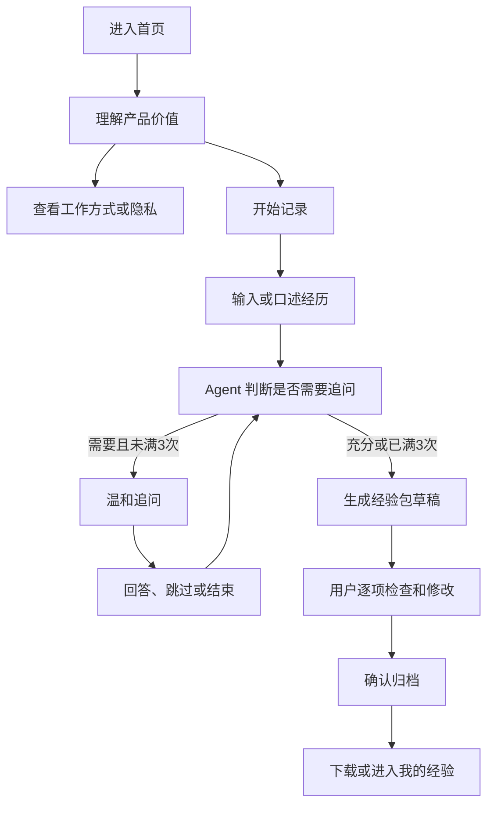
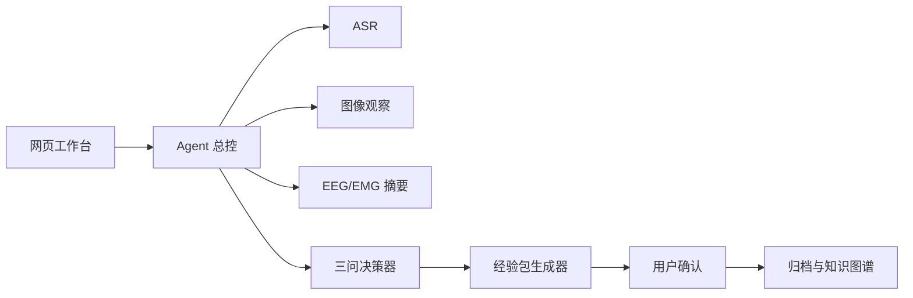
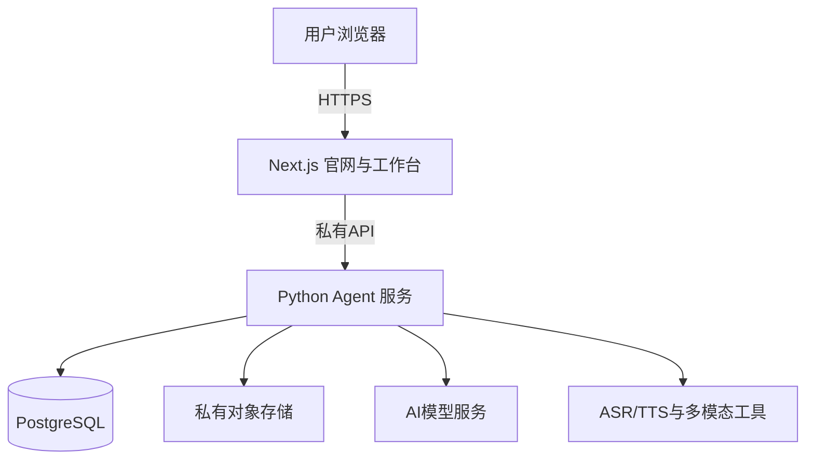

# 「拾光」官网与 Agent 工作台详细设计文档

> 文档版本：V1.0  
> 更新日期：2026-08-13  
> 产品阶段：MVP 官网与 Agent 嵌入设计  
> 适用对象：产品设计、视觉设计、前端开发、后端开发、AI Agent 开发、测试  
> 核心约束：一次经验采集最多追问 3 次；用户可以跳过或提前结束；未提及的信息保持留白。

---

## 1. 文档目的

本文档用于指导「拾光」第一版官网和 Agent 工作台的设计与开发，回答以下问题：

1. 网站服务谁，解决什么问题；
2. 官网需要哪些页面，每个页面展示什么；
3. Agent 如何嵌入网站并完成“讲述—追问—生成—确认—归档”；
4. 每个按钮、状态、提示和异常应该如何表现；
5. 网站前端与现有 Python Agent 后台如何连接；
6. 如何处理语音、图像、EEG、EMG和用户隐私；
7. 第一版做到什么程度可以上线测试。

本文档不是品牌宣传提案，而是一份可以直接转化为页面、组件、接口和测试任务的执行规范。

---

## 2. 产品定义

### 2.1 产品名称

- 中文名：拾光
- 英文工作名：Wisdom Pack
- 产品描述：人类智慧经验采集与封装 Agent

### 2.2 一句话定义

拾光通过温和的 AI 访谈和多模态证据采集，把容易消失的个人经历整理成可理解、可保存、可检索、可复用的经验包。

### 2.3 产品不是

- 不是心理诊断工具；
- 不是脑电读心工具；
- 不是情绪测谎工具；
- 不是自动替用户定义人生意义的机器；
- 不是要求用户回答所有问题的问卷；
- 不是未经确认就公开个人故事的内容平台。

### 2.4 产品价值

对用户：

- 降低记录经历的表达门槛；
- 从零散讲述中保留关键细节；
- 帮助用户回顾行动、判断、结果和理解；
- 让经验可以导出、检索和长期保存；
- 由用户决定哪些内容保留、删除或传播。

对产品长期发展：

- 形成结构化经验数据；
- 建立“人物—场景—事件—技能—决策—结果—证据”知识关系；
- 支持未来的经验搜索、技能手册和跨经验关联；
- 为硬件多模态采集提供统一的软件入口。

---

## 3. 第一版目标与边界

### 3.1 第一版必须完成

1. 访客能在 30 秒内理解产品；
2. 用户能从首页进入 Agent 工作台；
3. 用户能输入一段自由讲述；
4. Agent 能进行最多 3 次温和追问；
5. 用户能跳过或提前结束；
6. 用户能添加音频、图像、EEG、EMG文件；
7. Agent 能生成结构化经验包；
8. 用户能预览并修改经验包；
9. 用户确认后才归档；
10. 用户能下载 Markdown 和 JSON；
11. 网站清晰说明隐私和生理信号解释边界；
12. 手机和电脑均可使用。

### 3.2 第一版暂不实现

- 公开经验社区；
- 点赞、评论、关注；
- 支付和订阅；
- 多人共同编辑；
- 完整 Neo4j 图谱可视化；
- 医疗判断；
- 依据脑电、肌电或表情识别具体情绪；
- ESP32 自动配网和复杂设备管理；
- 原生 iOS 或 Android App。

### 3.3 成功指标

产品验证阶段优先关注：

| 指标 | 第一版目标 |
|---|---:|
| 首页到开始采集的转化率 | ≥ 20% |
| 开始采集后完成首次讲述 | ≥ 70% |
| 完成三问或主动结束 | ≥ 60% |
| 生成经验包 | ≥ 50% |
| 对经验包进行确认或修改 | ≥ 35% |
| 用户主观评价“问题自然” | ≥ 80% |
| 单次访谈平均提问数 | ≤ 3 |
| 出现重复追问 | < 5% |

“问题数量更多”不是成功指标；用户愿意完成并认可结果才是。

---

## 4. 目标用户与核心场景

### 4.1 主要用户

第一版面向希望记录个人经历的普通用户，不要求技术背景。

典型特征：

- 有值得记录的经历，但不擅长写长文；
- 更愿意讲述，而不是填写复杂表格；
- 对隐私敏感；
- 希望内容忠于自己，而不是被 AI 过度美化；
- 可能在未来使用摄像头、麦克风和穿戴传感器。

### 4.2 第一版推荐场景

- 一次旅行或相遇；
- 一次成功或失败的决策；
- 解决一个具体问题；
- 学会一项技能的过程；
- 一段值得保存的生活经历；
- 对某个事件的回顾。

### 4.3 用户核心顾虑

| 顾虑 | 设计回应 |
|---|---|
| “AI 会不会一直盘问？” | 全站明确显示最多追问 3 次 |
| “我不想回答怎么办？” | 每轮提供跳过和提前结束 |
| “AI 会不会曲解我？” | 生成后必须由用户编辑和确认 |
| “我的内容会公开吗？” | 默认私密，公开必须单独确认 |
| “脑电会不会读出想法？” | 明确说明只记录描述性指标 |
| “上传后还能删除吗？” | 提供删除会话、证据和经验包入口 |

---

## 5. 网站总体结构

网站分为两个产品区域。

### 5.1 官网宣传层

作用：让访客理解、信任并开始体验。

- `/`：首页
- `/how-it-works`：产品原理
- `/privacy`：隐私与数据边界

### 5.2 Agent 私密工作台

作用：完成真实经验采集和整理。

- `/studio`：开始讲述或恢复会话
- `/studio/session/[id]`：三问轻访谈
- `/studio/package/[id]`：经验包预览、修改和确认
- `/library`：我的经验；可安排在 V1.1

### 5.3 全局用户路径



---

## 6. 全局导航设计

### 6.1 桌面端导航

左侧：

- 拾光 Logo
- 产品名“拾光”

中部：

- 如何工作
- 隐私与边界
- 关于我们（第一版可以放页脚，不必成为独立页面）

右侧：

- 次按钮：“查看示例”
- 主按钮：“开始记录”

### 6.2 移动端导航

- 左侧保留 Logo 和“拾光”；
- 右侧保留“开始记录”；
- 其他导航收入菜单；
- Agent访谈期间不显示宣传导航，减少干扰；
- 访谈页面只显示返回、保存状态和隐私入口。

### 6.3 页脚

包含：

- 一句话产品定义；
- 如何工作；
- 隐私说明；
- 数据删除说明；
- 联系方式占位；
- “本产品不用于医疗诊断”；
- 版本号和年份。

---

## 7. 首页详细设计

### 7.1 首页目标

让第一次访问的用户快速完成三个认知：

1. 我可以把一段经历讲给它；
2. 它最多只问三次，不会审问我；
3. 最终得到的是由我确认的经验包，而不是 AI 擅自解释。

### 7.2 第一屏：核心价值

#### 左侧内容

眉题：

> HUMAN WISDOM PACKAGE

主标题：

> 让一段容易消失的经历，  
> 变成可以被理解与传递的经验。

副文案：

> 自然地讲，拾光会最多轻轻追问三次，为你整理出一份忠于原意的经验包。没有说到的地方，保持留白。

主要按钮：

> 开始记录一段经历

次要按钮：

> 看看它如何工作

信任短句：

> 默认私密 · 随时跳过 · 由你最终确认

#### 右侧视觉

不建议使用“机器人头像”或赛博大脑。建议用一张抽象的经验卡片组合：

- 一段自然讲述；
- 三个柔和的追问圆点；
- 一张逐渐成形的经验包；
- 一条由“场景—事件—选择—理解”构成的细线。

视觉重点是“保存记忆”和“温和陪伴”，不是“强大AI”。

### 7.3 第二屏：三步工作方式

标题：

> 不需要先想清楚，先讲出来就好。

三张步骤卡：

1. **讲述**  
   输入或口述一段真实经历，也可以添加当时的声音和图像。

2. **轻问**  
   Agent只选择最值得补充的内容，最多追问三次，随时可以跳过。

3. **确认**  
   你检查、修改并确认经验包。AI不会替你决定这段经历意味着什么。

### 7.4 第三屏：经验包示例

展示一份经过匿名化的示例卡片：

- 标题；
- 一句话摘要；
- 背景；
- 关键事件；
- 当时的感受（标记“用户自述”）；
- 做出的选择；
- 后来的理解；
- 留白内容；
- 证据数量。

示例卡必须有标签区分：

- `用户自述`
- `直接事实`
- `AI候选整理`
- `用户已确认`

按钮：

> 查看完整示例

### 7.5 第四屏：多模态能力

标题：

> 经历不仅存在于文字里。

四个能力模块：

- 语音：保留讲述的原始表达，并生成可校对文字；
- 图像：记录场景、物体和可见动作；
- 肌电：记录相对基线的肌肉活动变化；
- 脑电：保存设备指标、信号质量与时间变化。

必须紧邻显示边界说明：

> 生理信号只作为描述性元数据。拾光不会用脑电、肌电或表情断言你的思想、人格、情绪或真实意图。

### 7.6 第五屏：隐私与控制权

标题：

> 你的经历，控制权始终属于你。

四条承诺：

- 默认私密；
- 发布前确认；
- 支持修改和删除；
- 原始生理数据不进入公开经验包。

按钮：

> 阅读隐私与数据边界

### 7.7 最终行动区

标题：

> 有一段经历，值得从今天开始留下来吗？

按钮：

> 开始我的第一份经验包

辅助提示：

> 通常只需要 3—8 分钟。你可以随时结束。

---

## 8. “如何工作”页面

### 8.1 页面目标

用容易理解的方式说明 Agent 的完整工作流，建立透明度，而不是堆砌模型名和技术术语。

### 8.2 页面结构

#### 模块一：采集流程

用时间线展示：

1. 创建一次私密采集；
2. 讲述经历；
3. 添加可选证据；
4. Agent识别已知内容和重要留白；
5. 最多三次追问；
6. 生成经验包草稿；
7. 用户修改确认；
8. 本地或云端私密归档。

#### 模块二：Agent如何决定是否提问

说明：

- 不是逐项填表；
- 优先选择一个最影响理解的问题；
- 信息已经足够时可以少于三问；
- 用户跳过后不再沿同一方向追问；
- 三问用完后必须停止；
- 缺失字段标记为“未提及”。

#### 模块三：经验包包含什么

- 原始讲述；
- 经用户确认的整理文本；
- 事件时间线；
- 技能和决策候选；
- 用户自述的感受；
- 结果和回看；
- 未知或留白；
- 证据索引；
- 知识图谱候选。

#### 模块四：事实、表达和推断

用对照卡展示：

| 类型 | 示例 | 是否可直接写为事实 |
|---|---|---|
| 用户自述 | “我好像有点喜欢他” | 只能写为用户自述 |
| 可见事实 | “视频中人物拿起杯子” | 可以写为可见观察 |
| 生理数据 | “肌电相对基线上升” | 只能写统计变化 |
| 模型推断 | “可能处于高投入状态” | 必须标置信度和依据 |

#### 模块五：技术结构简图



---

## 9. 隐私与数据边界页面

### 9.1 页面目标

让用户在开始采集前清楚知道：收集什么、为什么收集、保存在哪里、谁能看到、怎样删除，以及系统绝不会做什么。

### 9.2 内容结构

#### 我们可能收集的数据

- 用户输入的文字；
- 用户上传或录制的音频；
- 用户主动上传的图像；
- EEG、EMG时间序列和设备元数据；
- Agent生成的追问、摘要和候选标签；
- 用户对经验包所做的修改和确认记录。

#### 数据用途

- 完成本次经验采集；
- 生成经验包；
- 在用户授权范围内建立私人知识关系；
- 改善用户自己的后续检索体验。

禁止默认写入“用于训练模型”。如果未来需要使用用户数据改进模型，必须单独、明确、自愿授权，且默认关闭。

#### 默认权限

- 新建会话：私密；
- 新建经验包：草稿；
- 原始生理数据：私密；
- 公开传播：关闭；
- 第三方姓名：提示匿名化。

#### 生理信号边界

页面需醒目显示：

> 拾光不会声称从脑电或肌电中读取思想，也不会仅凭生理变化判定具体情绪、人格、疾病或决策。设备指标只作为当时状态的描述性元数据。

#### 用户权利

- 查看；
- 修改；
- 下载；
- 删除单个证据；
- 删除会话；
- 删除经验包；
- 导出全部数据；
- 撤销传播授权。

#### 采集同意组件

开始多模态采集前使用分项选择，不使用一个总开关：

- `[ ]` 我同意保存本次文字和对话；
- `[ ]` 我同意保存音频；
- `[ ]` 我同意保存图像；
- `[ ]` 我同意保存EEG数据；
- `[ ]` 我同意保存EMG数据；
- `[ ]` 我确认已获得画面或录音中其他人物的必要授权。

未选择的模态不得采集或上传。

---

## 10. Agent 工作台首页 `/studio`

### 10.1 页面目标

消除“我要写一篇完整文章”的压力，让用户快速开始自然讲述。

### 10.2 页面布局

桌面端：居中单列，正文最大宽度 760px。  
移动端：全宽卡片，底部固定主要按钮。

### 10.3 页面内容

标题：

> 你想留下哪一段经历？

说明：

> 不需要先整理。可以从“有一次……”开始，也可以直接说最让你记得的画面。

大文本框占位文案：

> 例如：我在台湾交换期间去台南玩，在青旅遇到了一个人……

输入方式：

- 键盘输入；
- 按住或点击录音；
- 上传已有音频；
- 添加图片或传感器数据。

主要按钮：

> 开始轻访谈

辅助按钮：

> 使用示例体验

底部提示：

> Agent最多追问3次。你可以跳过任何问题，也可以随时结束。

### 10.4 输入校验

- 空内容：按钮禁用；
- 少于 5 个字符：提示“再多说一点点，哪怕只是一句话”；
- 超长内容：允许提交，但提醒长内容处理可能需要更多时间；
- 上传过程中：禁止重复提交；
- 网络失败：保留输入内容，显示重试；
- 不将输入内容写入错误日志。

---

## 11. 轻访谈页面 `/studio/session/[id]`

### 11.1 页面设计原则

1. 像陪伴式记录，不像聊天机器人客服；
2. 每屏只有一个当前问题；
3. “1/3”必须持续可见；
4. 跳过与提前结束容易找到；
5. 不展示100分完整度，避免给用户考试感；
6. 不出现“信息不足”“未完成”等责备性语言。

### 11.2 桌面布局

左侧约 68%：对话和输入区。  
右侧约 32%：进度、证据和隐私提示。

### 11.3 顶部信息

- 返回；
- 当前经验标题；
- 自动保存状态：`已保存`、`正在保存`、`保存失败`；
- 隐私状态：`仅自己可见`。

### 11.4 对话区

用户消息：暖灰底，右对齐。  
Agent消息：浅米色底，左侧酒红细线，左对齐。

Agent问题示例：

> 如果你愿意多说一点，这段经历里哪个小细节最让你记得？

避免：

> 请分别说明他的行为、你的情绪、你的决策依据以及后续结果。

### 11.5 输入区

包含：

- 多行文字输入；
- 录音按钮；
- 添加证据；
- 回答并继续；
- 跳过；
- 提前结束。

键盘规则：

- Enter：换行；
- Command/Ctrl + Enter：提交；
- 提交后按钮进入加载态；
- 后台返回前禁止重复提交。

### 11.6 进度区

不显示“完整度24/100”，改为：

> 轻访谈 1 / 3

三条短进度线表示已使用次数。说明：

> 最多再问2次。你也可以现在结束。

### 11.7 证据区

按模态显示：

- 语音：未添加／上传中／待校对／已确认；
- 图像：未添加／分析中／待确认／已确认；
- EEG：未添加／信号文件已关联／质量不足；
- EMG：未添加／信号文件已关联／质量不足。

每个文件显示：

- 文件名；
- 类型；
- 大小；
- 上传状态；
- 删除按钮；
- 是否进入传播版经验包的开关，默认关闭。

### 11.8 三问结束状态

结束时不再显示输入框，改为：

标题：

> 谢谢你讲到这里。

说明：

> 我会忠于你的表达整理一份草稿。没有讲到的地方会保持留白，你可以在下一步修改。

按钮：

> 生成经验包草稿

次按钮：

> 返回补充一句

“返回补充一句”不是第4次Agent追问，而是用户主动补充。

---

## 12. Agent 决策与文案规则

### 12.1 可执行动作

Agent每轮只能返回：

- `ask`：提出一次追问；
- `finish`：停止追问并进入生成；
- `safety_stop`：涉及即时安全风险时停止普通流程。

### 12.2 三问硬限制

- `questions_used = 0`：最多还可问3次；
- `questions_used = 1`：最多还可问2次；
- `questions_used = 2`：最多还可问1次；
- `questions_used >= 3`：后台强制改为`finish`；
- 限制必须存在于后台，不能只靠提示词；
- 刷新页面、重新登录和服务重启都不能重置次数。

### 12.3 问题质量要求

每个问题应：

- 少于55个汉字；
- 只有一个问号；
- 不包含多个并列任务；
- 优先使用“如果你愿意”“有没有一个细节”；
- 不使用“必须”“请完整说明”；
- 不暗示某种情绪答案；
- 不重复用户已经回答的内容；
- 尊重“不记得”“不想讲”和沉默。

### 12.4 结束条件

满足任一条件即可结束：

- Agent认为当前材料已经能够忠实整理；
- 已追问3次；
- 用户点击提前结束；
- 用户表达不希望继续；
- 出现安全停止条件。

不再使用“达到80分才允许结束”的设计。

---

## 13. 经验包预览与编辑页面 `/studio/package/[id]`

### 13.1 页面目标

让用户检查“AI是否理解正确”，而不是仅展示一篇不可修改的成品。

### 13.2 页面顶部

- 状态：`AI草稿 · 尚未确认`；
- 自动保存状态；
- 返回访谈；
- 删除草稿；
- 确认归档。

### 13.3 编辑区域

按照以下顺序：

1. 标题；
2. 一句话摘要；
3. 经历正文；
4. 背景与场景；
5. 关键事件；
6. 使用或体现的技能；
7. 用户自述的感受；
8. 做出的决定；
9. 后续结果；
10. 现在的理解；
11. 未提及和保留留白；
12. 关联证据；
13. 知识图谱候选。

### 13.4 字段来源标签

每个字段右上角显示来源：

- `来自你的原话`
- `AI整理`
- `AI候选推断`
- `你已修改`
- `未提及`

AI候选推断必须额外显示：

- 置信度；
- 支持依据；
- 接受、修改、删除按钮。

### 13.5 用户确认

点击“确认归档”前显示确认窗口：

> 我确认这份经验包基本符合我的表达。我知道可以在以后继续修改或删除。

选项：

- 保存为私人经验包；
- 同时下载到本机；
- 允许进入私人知识图谱；
- 公开传播选项第一版默认不提供，或明确默认关闭。

### 13.6 导出格式

- Markdown：适合阅读与编辑；
- JSON：适合机器读取；
- PDF：V1.1加入；
- 图谱JSON：节点和关系候选；
- 原始证据：单独导出，不混入公开文档。

---

## 14. “我的经验”页面 `/library`

可作为 V1.1，但设计时预留入口。

### 14.1 列表内容

每张经验卡显示：

- 标题；
- 一句话摘要；
- 创建日期；
- 状态：采集中／草稿／已确认；
- 证据模态图标；
- 隐私状态；
- 最近修改时间。

### 14.2 筛选

- 全部；
- 采集中；
- 待确认；
- 已归档；
- 按场景；
- 按技能；
- 按年份。

### 14.3 操作

- 继续采集；
- 打开经验包；
- 下载；
- 复制；
- 删除；
- 进入知识关系视图。

---

## 15. 视觉设计规范

### 15.1 视觉关键词

- 温和；
- 安静；
- 可信；
- 有纸张质感；
- 人本而非科技炫技；
- 有时间沉淀感。

### 15.2 颜色

建议基础色：

| 用途 | 色值 | 说明 |
|---|---|---|
| 页面背景 | `#F3EEE5` | 暖米色，降低工具感 |
| 卡片背景 | `#FFFDF8` | 接近纸张 |
| 主文字 | `#29251F` | 暖黑色 |
| 品牌主色 | `#873E4A` | 酒红色，用于关键动作 |
| 辅助色 | `#566B5E` | 鼠尾草绿，用于完成和归档 |
| 边框 | `#D9D0C2` | 柔和分隔 |
| 次文字 | `#756E64` | 降低视觉层级 |
| 错误 | `#A33E32` | 只用于明确错误 |
| 警告 | `#A8732B` | 上传或信号质量提示 |

颜色不得作为唯一状态信号，必须配合文字或图标。

### 15.3 字体

- 标题：中文宋体风格或高质量衬线字体；
- 正文：系统中文无衬线字体；
- 数据和英文标签：简洁无衬线字体；
- 正文最小字号：桌面14px，移动端15px；
- 隐私、安全正文不得使用低于12px的小字隐藏。

### 15.4 圆角与阴影

- 主卡片圆角：16—20px；
- 按钮圆角：999px；
- 输入框圆角：12—16px；
- 阴影轻微，不使用强烈发光；
- 信息层级主要靠留白、字号和边框建立。

### 15.5 图像风格

推荐：

- 生活场景局部；
- 手写、纸张、录音波形、照片边框；
- 抽象时间线；
- 柔和自然光。

避免：

- 发光大脑；
- 人脑接满电线；
- 机器人与人握手；
- 医疗监护仪式画面；
- 夸张的脑电“读心”视觉。

### 15.6 动效

- 页面过渡150—250ms；
- Agent生成时使用缓慢的三个呼吸点；
- 不模拟“正在输入”过久；
- 上传展示真实进度；
- 尊重系统“减少动态效果”设置。

---

## 16. 响应式设计

### 16.1 断点建议

- 手机：`< 768px`
- 平板：`768—1023px`
- 桌面：`≥ 1024px`
- 大屏：内容最大宽度不超过1200px

### 16.2 手机端重点

- 主要按钮高度至少48px；
- 可点击区域至少44×44px；
- 输入框避免被键盘完全遮挡；
- 提交按钮可固定在底部，但不能遮挡内容；
- 证据面板折叠；
- 对话消息最大宽度92%；
- 文件上传支持相机和录音入口；
- 网络切换后保留未提交文字。

### 16.3 桌面端重点

- 访谈页双栏；
- 对话区保持视觉主导；
- 侧栏不超过360px；
- 经验包编辑区最大宽度820px；
- 长文本保持舒适行宽，每行约35—50个汉字。

---

## 17. 无障碍要求

- 页面使用语义化标题层级；
- 所有输入框有可见标签；
- 图标按钮有可读名称；
- 键盘可以完成全部流程；
- 对话新增内容使用温和的`aria-live`提示；
- 焦点顺序与视觉顺序一致；
- 文本与背景对比度满足WCAG AA；
- 录音内容同时提供文字；
- TTS问题同时显示文字；
- 错误不能只靠颜色表达；
- 弹窗打开后焦点进入弹窗，关闭后返回原按钮。

---

## 18. 前端组件清单

### 18.1 全局组件

- `Header`
- `Footer`
- `PrimaryButton`
- `SecondaryButton`
- `StatusBadge`
- `PrivacyBadge`
- `ConfirmDialog`
- `Toast`
- `LoadingState`
- `ErrorState`

### 18.2 官网组件

- `HeroSection`
- `HowItWorksSteps`
- `WisdomPackageDemo`
- `MultimodalCapabilities`
- `PrivacyPromise`
- `FinalCTA`

### 18.3 工作台组件

- `StoryComposer`
- `VoiceRecorder`
- `ConversationTimeline`
- `AgentMessage`
- `UserMessage`
- `QuestionCounter`
- `SkipButton`
- `FinishButton`
- `EvidenceUploader`
- `EvidenceItem`
- `AutosaveStatus`
- `PackageEditor`
- `SourceTag`
- `InferenceReviewCard`
- `GraphCandidatePreview`

---

## 19. 前端状态模型

### 19.1 会话状态

```text
new
→ creating
→ collecting
→ generating
→ ready_for_review
→ saving
→ archived
```

异常状态：

```text
offline
save_failed
upload_failed
generation_failed
safety_stop
deleted
```

### 19.2 状态与页面行为

| 状态 | 页面行为 |
|---|---|
| new | 显示初始讲述输入 |
| creating | 锁定按钮，建立会话 |
| collecting | 显示当前问题与回答区 |
| generating | 显示整理过程，不允许重复提交 |
| ready_for_review | 打开经验包编辑器 |
| saving | 显示保存状态 |
| archived | 显示已归档和下载入口 |
| offline | 保留本地输入，提示恢复网络 |
| safety_stop | 停止普通追问，显示现实支持建议 |

---

## 20. Agent 与网站的接口设计

现有 Python 原型已经包含基础接口。正式网站应保持清晰的版本前缀，例如`/api/v1`。

### 20.1 健康检查

```http
GET /api/health
```

返回：

```json
{
  "ok": true,
  "ai_mode": "openai",
  "max_questions": 3
}
```

### 20.2 新建会话

```http
POST /api/sessions
Content-Type: application/json
```

```json
{
  "story": "我在台湾交换期间去台南玩……",
  "title": "台南的一次相遇",
  "consent": {
    "text": true,
    "audio": false,
    "image": false,
    "eeg": false,
    "emg": false
  }
}
```

### 20.3 回答

```http
POST /api/sessions/{id}/answer
```

```json
{
  "answer": "我记得他话不多，但一直在照顾同行的人。",
  "client_request_id": "uuid-for-idempotency"
}
```

### 20.4 跳过

```http
POST /api/sessions/{id}/skip
```

跳过应记录为用户选择，不等于“问题已回答”。

### 20.5 提前结束

```http
POST /api/sessions/{id}/finish
```

### 20.6 上传证据

```http
POST /api/sessions/{id}/upload
Content-Type: multipart/form-data
```

正式版建议分两步：申请上传地址，再直传对象存储，避免大文件经过应用服务器。

### 20.7 生成经验包

```http
POST /api/sessions/{id}/package
```

### 20.8 修改经验包

正式版新增：

```http
PATCH /api/packages/{id}
```

请求必须包含版本号，防止覆盖其他修改：

```json
{
  "version": 2,
  "changes": {
    "title": "台南青旅的一次相遇",
    "reflection": "我仍然不确定那是不是喜欢。"
  }
}
```

### 20.9 确认归档

```http
POST /api/packages/{id}/confirm
```

确认记录：

- 用户ID；
- 时间；
- 版本号；
- 隐私范围；
- 是否进入私人图谱；
- 传播授权状态。

---

## 21. 技术架构建议

### 21.1 第一版推荐

前端：

- Next.js；
- TypeScript；
- CSS Modules或Tailwind；
- 表单校验库；
- 支持服务端渲染官网页面；
- 工作台使用客户端交互。

后台：

- 保留现有Python Agent逻辑；
- 正式化为FastAPI服务；
- Pydantic定义输入输出；
- SQLite用于本地原型；
- 上线后迁移PostgreSQL；
- 文件迁移至私有对象存储。

AI：

- 使用服务端调用，API Key不进入浏览器；
- 使用结构化输出约束Agent动作和经验包格式；
- 保存模型名、提示词版本和生成时间；
- AI失败时保留用户原文，允许重试；
- 三问限制由程序校验，不只依赖模型。

### 21.2 部署结构



### 21.3 环境变量

前端允许公开：

- `NEXT_PUBLIC_AGENT_API_BASE`

后台私密：

- `OPENAI_API_KEY`
- `DATABASE_URL`
- `OBJECT_STORAGE_KEY`
- `SESSION_SECRET`
- `ALLOWED_ORIGINS`

任何密钥都不能写入前端代码或提交到代码仓库。

---

## 22. 多模态接入设计

### 22.1 音频

流程：

```text
用户录音
→ 本地生成预览
→ 用户确认上传
→ ASR转写
→ 展示转写文本
→ 用户校对
→ 校对后文本进入Agent
```

状态：录音中、上传中、转写中、待校对、已确认、失败。

### 22.2 TTS

- Agent问题先返回文字；
- TTS作为可选播放；
- 自动播放默认关闭，避免突然发声；
- 用户可以重播；
- TTS失败不阻断文字访谈。

### 22.3 图像

- 上传前预览；
- 允许移除；
- AI只输出可观察内容；
- 人物身份、关系和情绪不从图像臆测；
- 图像描述需用户确认后才进入经验包。

### 22.4 EEG与EMG

上传内容：

- 原始文件；
-设备型号；
- 采样率；
- 时间戳；
- 通道；
- 信号质量；
- 校准信息。

展示内容：

- 信号是否有效；
- 数据覆盖时段；
- 相对个人基线变化；
- 缺失或异常区段；
- 明确的解释限制。

禁止直接展示：

- “你当时焦虑72%”；
- “你对他有84%的喜欢”；
- “检测到欺骗”；
- “读取到某项具体决策”。

---

## 23. 知识图谱候选设计

第一版不必做复杂图形编辑器，但经验包应能生成候选节点和关系。

### 23.1 节点类型

- Person；
- Experience；
- Scene；
- Event；
- Skill；
- Decision；
- Observation；
- Outcome；
- Reflection；
- Evidence。

### 23.2 关系类型

- `OWNS_EXPERIENCE`
- `OCCURRED_IN`
- `CONTAINS_EVENT`
- `PERFORMED_SKILL`
- `MADE_DECISION`
- `BASED_ON`
- `RESULTED_IN`
- `REFLECTED_AS`
- `SUPPORTED_BY`

### 23.3 用户确认方式

用列表而非复杂关系图：

> 人物“我” — 参与 — 事件“第二次去台南”  
> 事件“喝醉后被送回” — 发生于 — 场景“台南青旅”

每条支持：接受、修改、删除。确认后再写入正式图谱。

---

## 24. 错误与空状态设计

### 24.1 AI暂时不可用

文案：

> 整理服务暂时没有响应。你的讲述已经安全保存，可以稍后重试。

按钮：重试整理、下载原始讲述、稍后继续。

### 24.2 上传失败

> 这个文件没有上传成功，但不会影响你继续讲述。

显示具体原因：过大、类型不支持、网络中断或服务器错误。

### 24.3 离线

> 当前没有网络。你输入的内容暂存在此设备，恢复网络后可以继续。

第一版若不能安全实现离线缓存，就不要承诺该能力。

### 24.4 没有历史经验

> 这里还没有经验包。可以从一件最近仍会想起的小事开始。

按钮：开始记录。

### 24.5 删除确认

区分：

- 删除草稿；
- 删除经验包；
- 删除原始证据；
- 删除全部会话数据。

文案必须说明是否可以恢复。

---

## 25. 安全与敏感场景

### 25.1 即时危险

如果用户表达正在发生的自伤、他伤或现实危险：

- 停止普通经验追问；
- 不继续追问故事细节；
- 鼓励联系当地紧急服务或可信任的人；
- 页面提供清晰的现实求助入口；
- 不声称网站能够提供紧急救助。

### 25.2 第三方隐私

- 自动提示用户避免填写真实姓名、电话、住址；
- 生成传播版本前提示匿名化；
- 涉及其他人的音视频时确认是否获得许可；
- 默认不进行人脸身份识别。

### 25.3 未成年人

若面向未成年人上线，需要独立设计年龄门槛、监护同意和更严格的数据策略。第一版可明确只面向成年人测试。

---

## 26. 性能要求

建议目标：

- 官网首屏主要内容加载：良好网络下2秒内；
- 用户提交后立即显示已收到状态；
- AI处理超过3秒显示进度说明；
- 超过30秒允许取消或稍后继续；
- 页面刷新后恢复当前会话；
- 上传使用分片或直传支持大文件；
- 图片上传前在浏览器适度压缩，但不覆盖原始文件；
- EEG、EMG原始文件不发送给语言模型，只发送分析摘要。

---

## 27. 数据埋点与隐私友好分析

只记录产品行为，不记录用户故事正文到分析平台。

### 27.1 推荐事件

- `homepage_viewed`
- `start_record_clicked`
- `session_created`
- `story_submitted`
- `question_shown`
- `question_answered`
- `question_skipped`
- `session_finished_early`
- `package_generated`
- `package_edited`
- `package_confirmed`
- `package_downloaded`
- `evidence_upload_started`
- `evidence_upload_succeeded`
- `evidence_upload_failed`

### 27.2 禁止进入埋点的数据

- 用户原文；
- Agent问题全文；
- 文件名中的个人信息；
- 音频和图片内容；
- 生理信号；
- API Key；
-完整经验包。

---

## 28. SEO与分享设计

官网公开页面需要：

- 独立标题和描述；
- 正确的Open Graph信息；
- 产品图用于链接预览；
- “AI经验采集”“个人经验记录”“智慧经验包”等自然关键词；
- 隐私页可被搜索；
- 工作台和私人经验包禁止搜索引擎索引；
- 分享链接不包含用户原文和会话ID明文信息。

首页标题建议：

> 拾光｜把经历整理成可保存、可传递的经验包

首页描述建议：

> 通过最多三次温和的AI追问，把自然讲述整理成由你确认的私人经验包。

---

## 29. 开发实施顺序

### 阶段A：设计确认

1. 确定产品名和一句话定位；
2. 确定五个核心页面；
3. 完成低保真线框；
4. 用台南故事走通完整原型；
5. 确认三问体验是否自然；
6. 冻结第一版字段和状态。

### 阶段B：官网前端

1. 建立Next.js项目；
2. 创建颜色、字体、间距等设计变量；
3. 开发Header和Footer；
4. 开发首页；
5. 开发如何工作页；
6. 开发隐私页；
7. 完成手机适配；
8. 检查无障碍。

### 阶段C：工作台前端

1. 开始讲述页；
2. 对话组件；
3. 三问进度；
4. 跳过和结束；
5. 文件上传；
6. 加载和错误状态；
7. 经验包编辑器；
8. 确认归档弹窗。

### 阶段D：接入现有Agent

1. 将Python服务升级为FastAPI；
2. 为接口添加版本；
3. 增加跨域白名单；
4. 增加用户或匿名会话身份；
5. 增加幂等请求ID；
6. 接通创建、回答、跳过、结束和生成；
7. 后台验证三问上限；
8. 增加经验包修改与确认接口。

### 阶段E：语音与图像

1. 浏览器录音；
2. 文件上传；
3. ASR转写；
4. 用户校对；
5. TTS播放；
6. 图片观察；
7. 用户确认图像描述。

### 阶段F：上线前工程化

1. 数据库迁移；
2. 私有对象存储；
3. 登录与用户隔离；
4. HTTPS；
5. 限流；
6. 删除与导出；
7. 错误监控；
8. 隐私政策和用户同意；
9. 备份恢复测试；
10. 小规模封闭测试。

### 阶段G：硬件接入

1. 定义设备身份；
2. ESP32上传会话ID和时间戳；
3. 统一时钟；
4. 接入EMG；
5. 接入EEG；
6. 信号质量反馈；
7. 生成描述性摘要；
8. 将摘要关联到时间线；
9. 不让生理信号覆盖用户自述。

---

## 30. 第一版页面验收标准

### 30.1 首页

- 30秒内可理解产品；
- 首屏明确“最多三问”；
- 有明确开始入口；
- 手机和桌面布局正常；
- 不使用读心或医疗暗示。

### 30.2 Agent工作台

- 可以输入一段自由讲述；
- 追问次数不会超过3；
- 每次只显示一个问题；
- 可以跳过；
- 可以提前结束；
- 重复点击不会提交两次；
- 刷新后能恢复会话；
- 失败时不丢失输入；
- 可上传允许的证据格式；
- 可删除上传文件。

### 30.3 经验包

- 能看到完整草稿；
- 能区分用户原话和AI整理；
- 能修改每个核心字段；
- 未提及内容保持留白；
- 用户确认前不正式归档；
- 可以下载Markdown和JSON；
- 可以删除；
- 图谱候选必须有证据。

### 30.4 隐私

- 默认私密；
- API Key不出现在浏览器代码；
- 私人页面禁止搜索索引；
- 生理信号边界清晰可见；
- 用户能找到删除入口；
- 日志和埋点不包含故事正文。

---

## 31. 测试案例

### 案例1：正常三问

用户提交台南故事，依次回答3次。预期：第3次回答后不再追问，进入生成。

### 案例2：第一次就跳过

用户点击跳过。预期：记录用户选择，Agent不重复同一方向，最多继续2问。

### 案例3：提前结束

用户首次讲述后立即结束。预期：允许生成经验包，缺失内容标记未提及。

### 案例4：AI试图第4次提问

模型返回`ask`，但计数已经为3。预期：后台强制转为`finish`。

### 案例5：网络中断

用户写完回答但请求失败。预期：输入仍在页面中，可再次提交。

### 案例6：重复提交

用户连续点击提交。预期：只产生一条消息和一次问题计数。

### 案例7：模糊情绪

用户说“我好像喜欢他”。预期：保留“好像”，标记用户自述，不改成“用户爱上了他”。

### 案例8：上传EEG

用户上传EEG CSV。预期：记录文件和质量摘要，不生成具体心理结论。

### 案例9：删除经验包

用户删除已归档经验。预期：明确告知证据、图谱关系和备份的处理方式。

---

## 32. 推荐的第一轮设计交付物

在正式开发前，设计师应提交：

1. 网站地图；
2. 首页桌面和手机版；
3. 如何工作页；
4. 隐私页；
5. 工作台初始状态；
6. Agent第1/3、第2/3、第3/3状态；
7. 跳过、提前结束和错误状态；
8. 文件上传状态；
9. 经验包编辑页；
10. 确认归档弹窗；
11. UI组件库；
12. 可点击原型。

开发接手前，必须用至少5种不同经历完整走查，而不是只测试一个案例。

---

## 33. 当前原型与正式官网的衔接

当前`Codex-shs`项目已经具备：

- Python本地服务器；
- SQLite会话保存；
- 最多3次追问；
- 跳过和提前结束；
- OpenAI结构化输出接口；
- 无Key演示模式；
- 证据文件上传；
- Markdown、JSON、对话和图谱候选归档。

正式官网开发时，不应推翻Agent核心，而应按以下方式迁移：

1. 保留`prompts.py`中的角色和三问规则；
2. 保留`ai_agent.py`的结构化动作思想；
3. 将`server.py`升级为FastAPI接口；
4. 将`frontend/`替换为Next.js官网与工作台；
5. 将SQLite替换为PostgreSQL时保留会话状态字段；
6. 增加经验包编辑和用户确认层；
7. 完成后再接入ASR、TTS和硬件。

---

## 34. 最终产品原则

所有设计和开发决策都应回到以下原则：

1. **先尊重，再结构化。** 不为了字段完整破坏用户表达。
2. **最多三问。** 这是体验承诺，也是后台硬规则。
3. **允许留白。** 未知比编造更有价值。
4. **用户确认。** AI只生成草稿，用户决定最终版本。
5. **证据可追溯。** 重要结论应知道来自哪里。
6. **推断有边界。** 不把生理信号包装成读心能力。
7. **默认私密。** 传播是用户主动选择，不是默认路径。
8. **内容比技术更重要。** 首页先讲用户价值，再讲传感器。
9. **失败不丢内容。** 网络或模型故障不能让用户重新讲述。
10. **先验证闭环，再扩展硬件。** 先证明经验包真的有价值。

---

## 35. 下一步行动清单

建议严格按照以下顺序执行：

- [ ] 确认产品名“拾光”和首页主文案；
- [ ] 依据本文制作五个页面的低保真线框；
- [ ] 用现有台南故事走查三问流程；
- [ ] 确认经验包字段是否过多；
- [ ] 完成视觉设计变量和组件规范；
- [ ] 建立Next.js官网前端；
- [ ] 先完成静态官网；
- [ ] 再完成Agent工作台；
- [ ] 接入现有Python接口；
- [ ] 增加经验包编辑和确认；
- [ ] 做手机端、无障碍和错误状态；
- [ ] 用5个真实案例封闭测试；
- [ ] 根据反馈调整问题语气；
- [ ] 最后接入语音、图像、EEG和EMG。

完成上述前10项后，产品就具备第一轮真实用户体验的基础。
